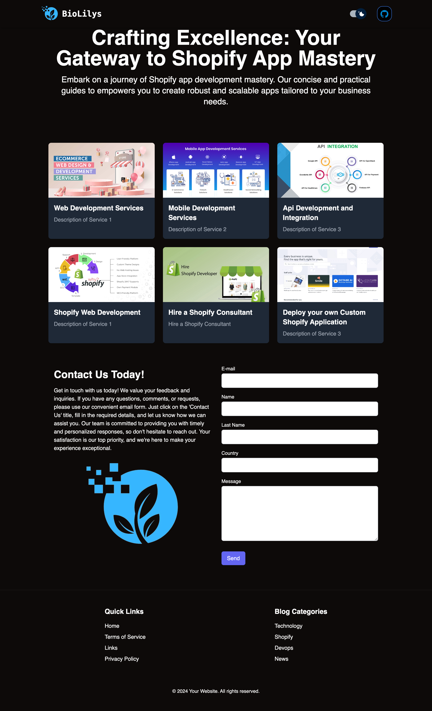

# Biolilys Site



## Overview

Clean and modern, our website design features a minimalist aesthetic with crisp typography and subtle animations. The layout is intuitively organized, guiding users seamlessly through our content.

## Tech Stack

- React.js
- TypeScript

## Biolilys Site

Vibrant imagery complements the user experience, creating a visually engaging platform that showcases our brand's identity and values.

Where:

- `usage`: Represents the usage amount in kWh (electricity), gallons (transportation), etc.
- `frequency`: Represents the frequency of usage (per month, per year, etc.)

## Installation

1. Clone the repository to your local machine:
   ```bash
   git clone https://github.com/yourusername/carbon-emissions-calculator.git
   ```

cd biolilys

npm install

npm run dev
